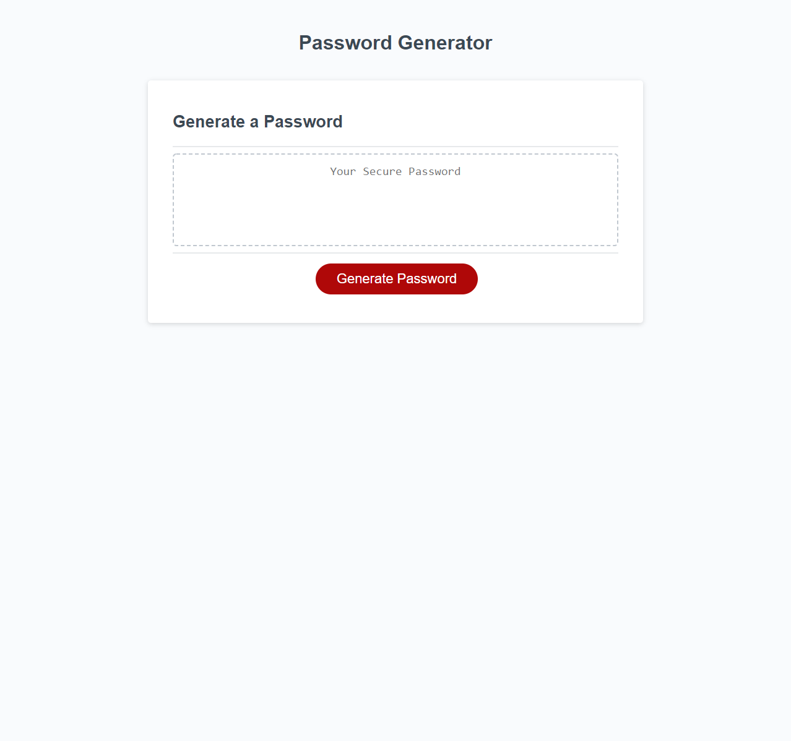

##Challenge

Hello, this project allows for a program to randomly generate passwords dependent on criteria that the user selects. This runs in-browser and will utilize HTML and CSS that is powered by JavaScript.

The password is intended to be created using lowercase, uppercase, numbers and special characters. The End User will be able to dictate the total length of their password from at least 8 characters to a maximum of 128.

Many thanks for w3 schools for being a valuable resource for this project.

The website required to view this generator is located <a href="https://snowslurpie.github.io/password-generator/" target="_blank"> here</a>

